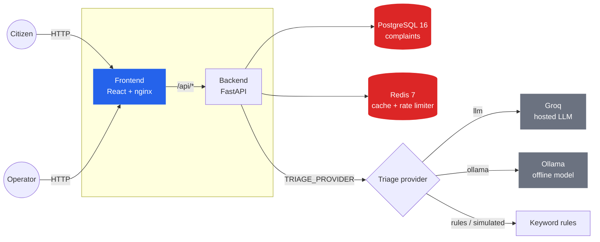
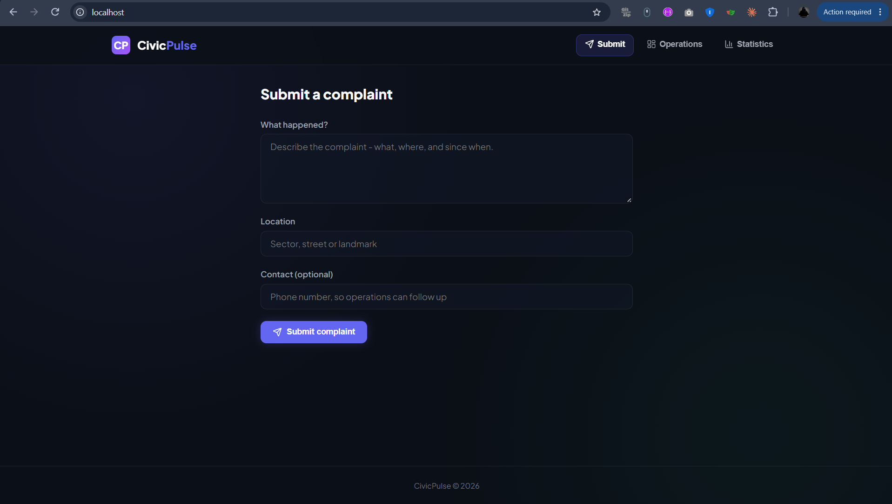
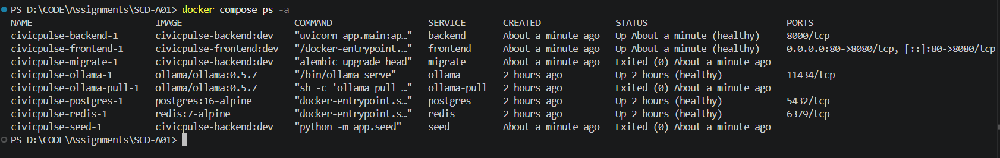
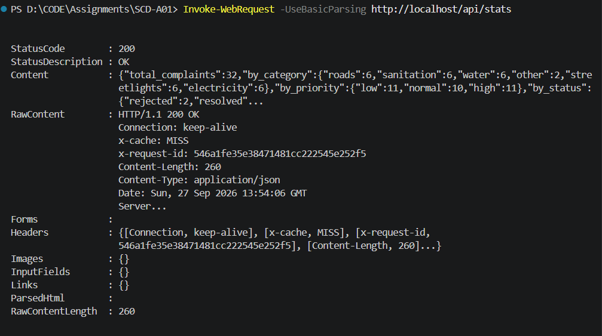
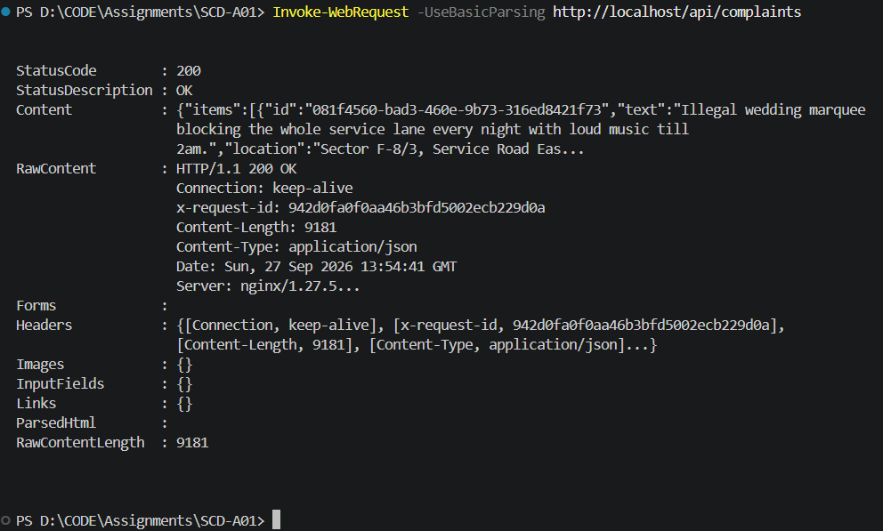

# CivicPulse

[](https://github.com/M-Hasaam/CivicPulse/actions/workflows/ci.yml)
[](https://github.com/M-Hasaam/CivicPulse/actions/workflows/cd.yml)
[](https://github.com/M-Hasaam/CivicPulse/actions/workflows/security.yml)
[](https://github.com/M-Hasaam/CivicPulse/actions/workflows/compose-smoke.yml)
[](LICENSE)

Municipal complaint intake, AI triage and operations platform.

Every municipality runs the same broken process: a citizen's free-text complaint lands in
an undifferentiated queue, and a burst water main sits behind three streetlight reports
because nothing sorted them. CivicPulse reads the text: a citizen submits a free-text
complaint, the backend triages it with an LLM (or a deterministic fallback) into a
category, a priority and a one-line summary, persists it durably, and surfaces it on a
live operations dashboard — as five cooperating containers on a laptop with one command,
or as a scaled, probed, autoscaling workload on Kubernetes.

## Contents

- [Architecture](#architecture)
- [Stack](#stack)
- [Quickstart (Docker Compose)](#quickstart-docker-compose)
- [Quickstart (Kubernetes)](#quickstart-kubernetes)
- [Run without Docker for the app (manual setup)](#run-without-docker-for-the-app-manual-setup)
- [API](#api)
- [Screenshots](#screenshots)
- [Documentation](#documentation)
- [Development](#development)
- [License](#license)

## Architecture



`frontend` only ever talks to `backend` (nginx proxies `/api` — see
`docs/adr/0002-frontend-runtime-config.md`); `backend` is the only service with a route to
both the data layer and the outside world. `postgres` and `redis` have no path to the
internet or to the frontend — see `compose.yaml`'s network comments and
`docs/evidence/compose-frontend-cannot-reach-postgres.png` for that proven live.

## Stack

- **Backend:** FastAPI + Pydantic v2 (Python 3.12)
- **Database:** PostgreSQL 16, schema managed by Alembic
- **Cache and rate limiter:** Redis 7
- **AI triage:** Groq (hosted), Ollama (offline) or keyword rules, behind one interface
- **Frontend:** React 18 + Vite + TypeScript

## Quickstart (Docker Compose)

This is the easiest way to run the whole project. You only need Docker Desktop.

### 1. Clone the repository

```powershell
git clone https://github.com/M-Hasaam/CivicPulse.git
cd CivicPulse
```

### 2. Create `.env` one time

```powershell
Copy-Item .env.example .env
```

On macOS/Linux:

```bash
cp .env.example .env
```

The default `.env` uses `TRIAGE_PROVIDER=rules`, so the app works without an API
key and without downloading an AI model.

### 3. Choose how to run triage

| Option | When to use it | `.env` value | Command |
| --- | --- | --- | --- |
| Rules, no Ollama | Fastest first run. No model download. | `TRIAGE_PROVIDER=rules` | `docker compose up -d --build --scale ollama=0 --scale ollama-pull=0` |
| Ollama | Fully offline AI triage. Downloads the model once. | `TRIAGE_PROVIDER=ollama` | `docker compose up -d --build` |

For a normal first run, use the rules option:

```powershell
docker compose up -d --build --scale ollama=0 --scale ollama-pull=0
```

If you choose Ollama, edit `.env` first:

```text
TRIAGE_PROVIDER=ollama
```

Then run:

```powershell
docker compose up -d --build
```

The first Ollama run downloads and warms the configured model into the
`ollama_models` volume.

### 4. Wait for the stack

On first start, Docker Compose:

- waits for Postgres and Redis to become healthy;
- runs the database migration (`migrate`);
- loads 32 demo complaints (`seed`, safe to repeat);
- starts the backend, then the frontend once the backend is healthy.

Check everything:

```powershell
docker compose ps -a
```

For the rules option, you should see:

- `frontend`, `backend`, `postgres` and `redis` are healthy;
- `migrate` and `seed` exited with code `0`;
- no `ollama` containers are running.

For the Ollama option, `ollama` should be running and `ollama-pull` should exit
with code `0`.

### 5. Open the app

| What | URL |
| --- | --- |
| App | http://localhost |
| API docs | http://localhost/docs |
| Backend readiness | http://localhost/ready |

Everyday commands:

```powershell
docker compose logs -f backend    # JSON logs, one line per event, with request_id
docker compose down               # stop; all data is kept in the volumes
docker compose down -v            # stop and delete the data
```

In development, `backend/app` is mounted into the container and uvicorn reloads
on save. `compose.prod.yaml` runs the published images by commit SHA instead,
with no mount, no reload and no published database ports:
`IMAGE_TAG=<sha> docker compose -f compose.prod.yaml up -d`.

If you reuse this repo's `.env` for that command, note that `TRIAGE_PROVIDER`
is deliberately *not* read by `compose.prod.yaml` - set `PROD_TRIAGE_PROVIDER`
in your deploy environment instead (defaults to `llm`); see `.env.example`.

## Quickstart (Kubernetes)

The same images run unmodified on Kubernetes — the frontend never has a backend URL baked
in (see `docs/adr/0002-frontend-runtime-config.md`), so nothing is rebuilt per environment.

### 1. Point `kubectl` at a cluster

Any local cluster works — `kind`, `k3d`, or Docker Desktop's own Kubernetes. For `kind`,
use the repo's config so the node gets the `ingress-ready=true` label step 2's Ingress
controller requires (the same config CI uses, `.github/kind-config.yaml`):

```powershell
kind create cluster --name civicpulse --config .github/kind-config.yaml
```

(`k3d` and Docker Desktop's Kubernetes don't need this label — it's only required by
the kind-specific ingress-nginx manifest installed in step 2.)

### 2. Install an Ingress controller

A fresh `kind` cluster has no Ingress controller, and [`k8s/base/ingress.yaml`](k8s/base/ingress.yaml)
needs one to route traffic. This is the same install CI uses (`.github/workflows/cd.yml`):

```powershell
kubectl apply -f https://raw.githubusercontent.com/kubernetes/ingress-nginx/controller-v1.11.3/deploy/static/provider/kind/deploy.yaml
kubectl wait --namespace ingress-nginx --for=condition=ready pod --selector=app.kubernetes.io/component=controller --timeout=120s
```

Skip this if your cluster already ships one (Docker Desktop's Kubernetes, most managed
clusters).

If the controller pod stays `Pending` (`kubectl describe pod -n ingress-nginx` shows
`Node-Selectors: ingress-ready=true` with no matching node), your cluster was created
without step 1's `--config` flag. Fix it without recreating the cluster:

```powershell
kubectl get nodes                                        # find the node name
kubectl label node civicpulse-control-plane ingress-ready=true
```

### 3. Install metrics-server

A fresh `kind` cluster also has no `metrics-server`, so `kubectl top` shows nothing and
the [`HorizontalPodAutoscaler`](k8s/base/hpa.yaml) has no CPU data to scale on — it'll sit
idle even under real load. Docker Desktop's own Kubernetes ships one automatically; `kind`
doesn't. Same install CI uses:

```powershell
kubectl apply -f https://github.com/kubernetes-sigs/metrics-server/releases/download/v0.7.2/components.yaml
kubectl patch deployment metrics-server -n kube-system --type=json `
  -p='[{"op":"add","path":"/spec/template/spec/containers/0/args/-","value":"--kubelet-insecure-tls"}]'
kubectl wait --namespace kube-system --for=condition=available deployment/metrics-server --timeout=120s
```

The `--kubelet-insecure-tls` patch is needed because `kind` nodes don't have kubelet
certificates metrics-server would otherwise trust — fine for a local dev cluster, never
do this against a real production one. `kubectl top nodes` and `kubectl top pods -n
civicpulse` may return nothing for the first 15-30s after this while metrics-server
collects its first sample.

### 4. Set a real database password

```powershell
Copy-Item k8s\overlays\prod\secrets.env.example k8s\overlays\prod\secrets.env
# edit k8s/overlays/prod/secrets.env and set a real POSTGRES_PASSWORD
```

`secrets.env` is gitignored; the committed `.example` file only ever has a placeholder.

### 5. Deploy

```powershell
kubectl apply -k k8s\overlays\prod
kubectl wait --for=condition=complete job/migrate -n civicpulse --timeout=180s
kubectl rollout status deployment/backend -n civicpulse --timeout=180s
kubectl rollout status deployment/frontend -n civicpulse --timeout=180s
```

Namespace, Deployments, a `StatefulSet` + PVC for Postgres, a `PodDisruptionBudget`, an
`HorizontalPodAutoscaler` and readiness/liveness/startup probes are all defined in
`k8s/base/`. Deleting the Postgres pod does not lose data — see
`docs/evidence/k8s-persistence-1-postgres-pod-deletion.txt`.

If `kubectl get ingress -n civicpulse` shows nothing afterward, step 2's controller pod
was `Ready` but its admission webhook wasn't quite up yet, so the API server's webhook
call for the `Ingress` resource timed out while everything else in this apply succeeded.
Just re-run `kubectl apply -k k8s\overlays\prod` — it's idempotent, so it only (re-)creates
the one resource that failed.

### 6. Reach the app

If your cluster doesn't expose an Ingress on the host, port-forward it:

```powershell
kubectl port-forward -n ingress-nginx service/ingress-nginx-controller 8080:80
curl.exe -H "Host: civicpulse.localhost" http://127.0.0.1:8080/ready
```

`curl.exe`, not `curl`: PowerShell aliases `curl` to `Invoke-WebRequest`, whose `-Headers`
parameter needs a hashtable, not a `"Key: Value"` string. If you'd rather use PowerShell's
native cmdlet instead of `curl.exe`:

```powershell
Invoke-WebRequest -Headers @{Host = "civicpulse.localhost"} http://127.0.0.1:8080/ready
```

Expect `{"status":"ready"}` back — the same response the Docker Compose version returns,
now reached through Kubernetes' Ingress instead of nginx's `ports: 80:8080`.

### 7. Tear down

```powershell
kind delete cluster --name civicpulse
```

Only removes the local `kind` cluster (its Docker containers and network endpoints) —
it doesn't touch the git repo or the separate Docker Compose stack. Re-run step 1 to
recreate it from scratch.

Full deploy, rollback, log-reading and troubleshooting procedures: `docs/RUNBOOK.md`.
HPA/VPA load-test results (real measured numbers, not estimates): `docs/evidence/hpa-*` and
`docs/evidence/vpa-*`.

## Run without Docker for the app (manual setup)

Useful for debugging the backend in your editor. The databases still run in containers.

| Service | Runs as | Address |
| --- | --- | --- |
| PostgreSQL 16 | Docker container `civicpulse-dev-pg` | `localhost:5432` |
| Redis 7 | Docker container `civicpulse-dev-redis` | `localhost:6379` |
| Ollama (optional) | Docker container `civicpulse-dev-ollama` | `localhost:11434` |
| Backend | `uvicorn` in `backend/.venv` | http://localhost:8000 (API docs at `/docs`) |
| Frontend | Vite dev server | http://localhost:5173 |

**Prerequisites:** Docker Desktop (running), Python 3.12, Node.js 22.
Commands are for PowerShell from the repository root; macOS/Linux differences are noted.

### 1. Start the containers (first time)

```powershell
docker run -d --name civicpulse-dev-pg `
  -e POSTGRES_USER=civicpulse -e POSTGRES_PASSWORD=change_me -e POSTGRES_DB=civicpulse `
  -p 5432:5432 postgres:16-alpine

docker run -d --name civicpulse-dev-redis -p 6379:6379 redis:7-alpine
```

**Optional: Ollama, the fully offline triage provider.** No API key and no data
leaves your machine, but it is slower and less accurate than Groq.

```powershell
docker run -d --name civicpulse-dev-ollama -p 11434:11434 `
  -v civicpulse-dev-ollama-models:/root/.ollama ollama/ollama:0.5.7

docker exec civicpulse-dev-ollama ollama pull llama3.2:1b   # ~1.3 GB, downloaded once into the volume
```

On macOS/Linux, replace the backtick line continuations with `\`.

### 2. Configure

```powershell
Copy-Item .env.example .env        # macOS/Linux: cp .env.example .env
```

The defaults already point at the containers above (`localhost`). Then choose
how complaints are triaged with `TRIAGE_PROVIDER` in `.env`:

| `TRIAGE_PROVIDER` | Needs | Notes |
| --- | --- | --- |
| `rules` (default) | nothing | Keyword rules. Works out of the box |
| `llm` | `GROQ_API_KEY` (free at https://console.groq.com) | Groq `openai/gpt-oss-20b`, ~1 s per complaint |
| `ollama` | the Ollama container above | `llama3.2:1b` on CPU: ~2 s per complaint, first call ~7 s while the model loads |
| `simulated` | nothing | Deterministic fake used by the tests |

Whatever you pick, any failure (timeout, rate limit, bad output, Ollama not
running) falls back to the rules and is recorded as `rules:fallback`: a
complaint is never rejected because the AI is unavailable.

`.env` is gitignored. Never commit it; add new variables to `.env.example`
with placeholder values instead.

### 3. Backend

```powershell
cd backend
python -m venv .venv
.\.venv\Scripts\Activate.ps1       # macOS/Linux: source .venv/bin/activate
pip install -e ".[dev]"
alembic upgrade head               # create the schema (never done at app startup)
python -m app.seed                 # 32 demo complaints; safe to run again
python -m uvicorn app.main:app --reload
```

Check it at http://localhost:8000/ready. It should say `{"status": "ready"}`.
Then try the API at http://localhost:8000/docs.

### 4. Frontend

In a second terminal:

```powershell
cd frontend
npm ci
npm run dev
```

Open http://localhost:5173.

### Day to day

The containers keep their data. Next time you only need to start them again,
then run the backend and frontend commands from steps 3 and 4 (skip the setup lines):

```powershell
docker start civicpulse-dev-pg civicpulse-dev-redis civicpulse-dev-ollama
docker stop  civicpulse-dev-pg civicpulse-dev-redis civicpulse-dev-ollama
```

(`docker run` a second time fails with "name already in use". Use `docker start`.)

### Troubleshooting

| Symptom | Cause and fix |
| --- | --- |
| `/ready` → 503 `postgres (...)` or `redis (...)` | That container is not running: `docker start civicpulse-dev-pg civicpulse-dev-redis` |
| `/ready` → 503 `... (gaierror)` | `.env` uses a Docker Compose hostname (`@postgres`, `redis://redis`). For local runs use `localhost` |
| Complaints come back `triaged_by: rules:fallback` | The provider failed: check the WARNING log line (it names the error). Usually a missing `GROQ_API_KEY` or Ollama not running |
| `uvicorn app.main:app` fails with "unexpected extra argument" | Run it as `python -m uvicorn app.main:app --reload` |
| Code changes are not picked up | Restart the backend (Ctrl+C, then run it again). `.env` changes always need a restart |
| Port 8000 or 5173 already in use | Another backend/frontend is still running; stop it first |

## API

| Method | Path | Behaviour |
| --- | --- | --- |
| `POST` | `/api/complaints` | Validate, triage, persist. **201**; **400** with field-level errors; **429** with `Retry-After` over the rate limit |
| `GET` | `/api/complaints/{id}` | **200** / **404** |
| `GET` | `/api/complaints` | Filter by `category`, `priority`, `status`; paginate with `page`, `page_size` (≤ 100); returns `total` |
| `PATCH` | `/api/complaints/{id}/status` | Enforces the state machine; invalid transition → **409** naming it |
| `GET` | `/api/stats` | Counts by category, priority and status; Redis-cached 30 s; `X-Cache: HIT \| MISS` (`BYPASS` if Redis is down) |
| `GET` | `/api/meta/providers` | Active provider, last 20 triage outcomes (provider, latency, fallback, cached) and the triage cache hit rate |
| `GET` | `/health` | Liveness: process alive, never touches a dependency |
| `GET` | `/ready` | Readiness: 200 only if Postgres and Redis answer; 503 naming what failed |
| `GET` | `/metrics` | Prometheus: request count and latency, triage latency, fallbacks, triage cache hits |

**Status machine:** `open → in_progress → resolved`, `open → rejected`,
`in_progress → rejected`. `resolved` and `rejected` are final.

**Triage:** see the provider table above. Duplicate complaints are served from a
24 h content-hash cache, so nine neighbours reporting the same burst main cost
one inference.

```powershell
curl -X POST http://localhost:8000/api/complaints -H "Content-Type: application/json" `
  -d '{"text": "Burst water main flooding Street 12 since fajr", "location": "G-10/4"}'
```

Every response carries an `X-Request-ID` (yours if you send one). Logs are JSON
on stdout, one line per event, each with that `request_id`.

## Screenshots

| | |
| --- | --- |
|  Frontend, submitting a complaint |  Full Compose stack: healthy, migrated, seeded |
|  `GET /api/stats` — aggregates, `X-Cache` |  `GET /api/complaints` — seeded data, paginated |

More evidence (branch protection, CI/CD gates blocking a real merge, HPA/VPA load-test
results, Kubernetes pod-deletion persistence, the merge-conflict resolution) is indexed in
[`docs/evidence/README.md`](docs/evidence/README.md).

## Documentation

| Document | What's in it |
| --- | --- |
| [`docs/RUNBOOK.md`](docs/RUNBOOK.md) | Deploy, rollback (imperative and declarative), reading structured logs, diagnosing triage fallbacks |
| [`docs/ENGINEERING-NOTES.md`](docs/ENGINEERING-NOTES.md) | Environment parity, the CI/CD maturity ladder, build-once-deploy-many, testing a probabilistic component deterministically, HPA lag (measured), VPA vs. HPA, network isolation vs. a hosted LLM, and a real incident |
| [`docs/TRIAGE.md`](docs/TRIAGE.md) | What each triage provider does, and a measured content-hash cache hit rate |
| [`docs/AI-USAGE.md`](docs/AI-USAGE.md) | Which parts of this repo AI tools wrote or shaped, and what changed afterward and why |
| [`docs/adr/`](docs/adr/) | Provider interface · frontend runtime config · deploy-by-SHA · PII and data governance |
| [`docs/evidence/README.md`](docs/evidence/README.md) | Index of every screenshot/log used as rubric evidence, and what's still outstanding |

## Development

From `backend/` with the virtualenv active:

```powershell
ruff check .
mypy app
pytest --cov=app        # tests never call a live LLM
```

From `frontend/`:

```powershell
npm run lint
npm run typecheck
npm run build
```

## License

[MIT](LICENSE) — © 2026 Muhammad Hasaam and Burhan Ahmed.
