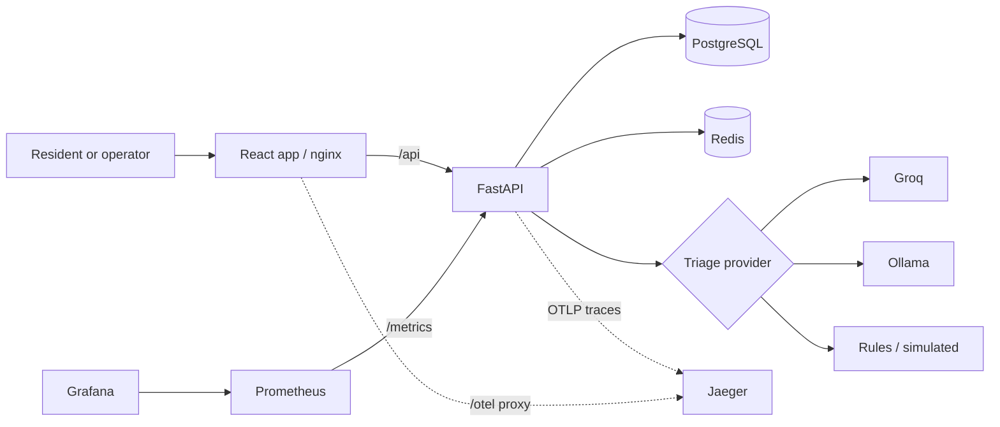
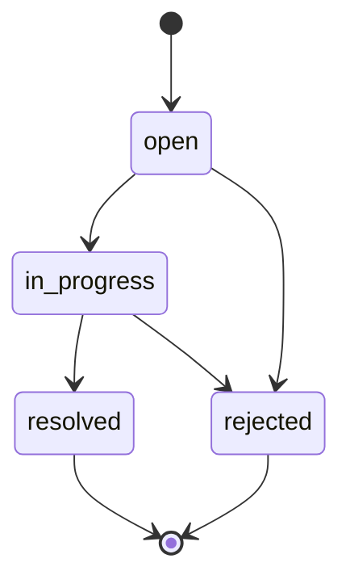
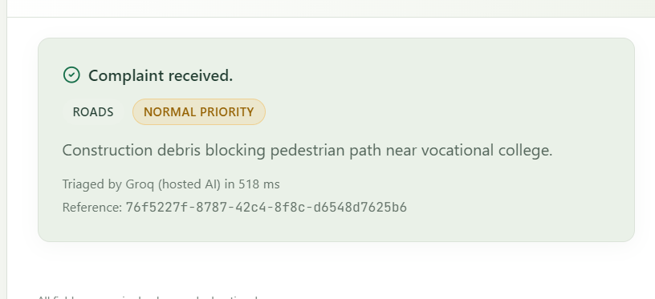
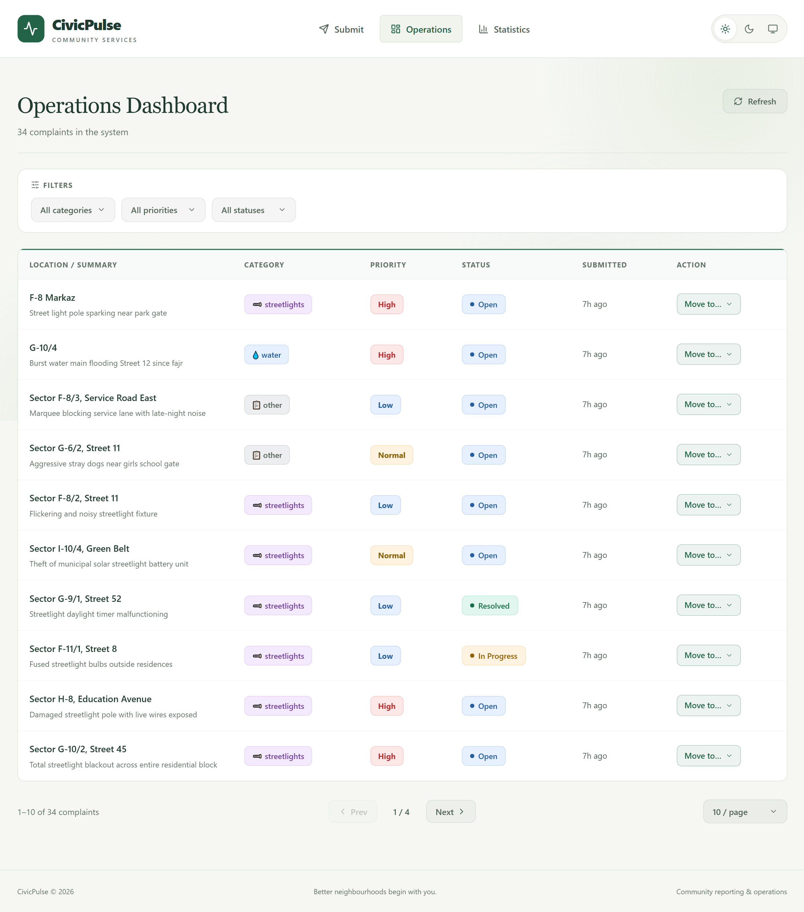
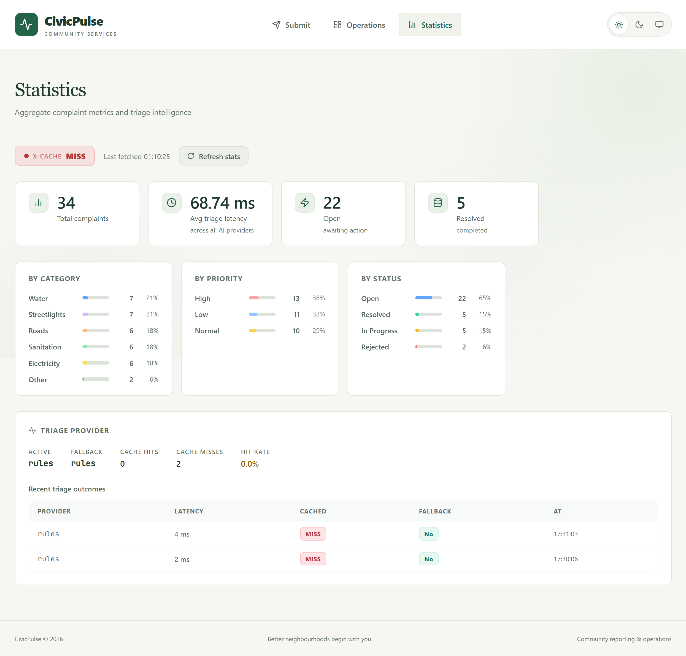

# CivicPulse

**Turn neighbourhood reports into actionable municipal work.**

[](https://github.com/M-Hasaam/CivicPulse/actions/workflows/ci.yml)
[](https://github.com/M-Hasaam/CivicPulse/actions/workflows/cd.yml)
[](https://github.com/M-Hasaam/CivicPulse/actions/workflows/security.yml)
[](https://github.com/M-Hasaam/CivicPulse/actions/workflows/compose-smoke.yml)
[](LICENSE)

CivicPulse is a municipal complaint intake, triage, and operations platform. Residents
submit a description and location; the backend assigns a category, priority, and summary;
operations staff review the queue and move complaints through their lifecycle.

Run it locally with Docker Compose and 32 demo complaints, use a hosted or local language
model for triage, or start with the built-in rules provider without an API key. The repository
also includes Kubernetes manifests, CI/CD workflows, metrics, tracing, and recorded deployment evidence.

## Contents

- [Features](#features)
- [Quickstart](#quickstart)
- [Triage and configuration](#triage-and-configuration)
- [Architecture](#architecture)
- [Local development](#local-development)
- [API](#api)
- [Observability](#observability)
- [Deployment](#deployment)
- [Checks and CI/CD](#checks-and-cicd)
- [Troubleshooting](#troubleshooting)
- [Screenshots](#screenshots)
- [Repository guide](#repository-guide)
- [License](#license)

## Features

| Area | What you can do |
| --- | --- |
| Complaint intake | Submit a description, location, and optional contact; receive a reference ID and triage result. |
| Operations dashboard | Filter by category, priority, and status; page through reports; refresh the queue and update a complaint's status. |
| Statistics | View complaint totals, category and priority breakdowns, average triage latency, and recent provider outcomes. |
| Resilient triage | Choose Groq, Ollama, keyword rules, or a deterministic test provider; provider failures fall back to rules. |
| Efficient requests | Reuse cached triage results, cache aggregate statistics, and limit complaint submissions per client. |
| Operations tooling | Inspect structured logs, health checks, Prometheus metrics, Grafana dashboards, and OpenTelemetry traces. |

The interface supports light, dark, and system themes. See the [screenshots](#screenshots)
for the submission, operations, and statistics views.

## Quickstart

**Prerequisites:** Git and a running Docker installation with Docker Compose v2
(for example, Docker Desktop). Local Python and Node.js installations are unnecessary for this path.
Commands below use PowerShell; the Docker and Git commands also work in a POSIX shell.

### 1. Get the project and configure it

```powershell
git clone https://github.com/M-Hasaam/CivicPulse.git
cd CivicPulse
Copy-Item .env.example .env
```

On macOS/Linux, use `cp .env.example .env` for the last command. If you already have a
checkout and `.env`, keep your existing configuration.

The template selects `TRIAGE_PROVIDER=rules`. Set `POSTGRES_PASSWORD` in `.env`; use
letters, digits, `-`, `_`, or `.` because the deployment files insert it directly into a
connection URL. `.env` is ignored by Git; [.env.example](.env.example) documents the settings.

### 2. Build and start

```powershell
docker compose up -d --build --scale ollama=0 --scale ollama-pull=0
docker compose ps -a
```

This starts the application, PostgreSQL, Redis, Prometheus, Grafana, and Jaeger without
downloading an AI model. On a fresh database, startup runs Alembic migrations and seeds
32 demo complaints before starting the backend and frontend.

Expect `frontend`, `backend`, `postgres`, and `redis` to become healthy. The one-time
`migrate` and `seed` containers should finish with exit code `0`; their exited status is normal.
The seed command is safe to repeat.

### 3. Open the application

| Page or endpoint | Address |
| --- | --- |
| Submit a complaint | [localhost/submit](http://localhost/submit) |
| Operations dashboard | [localhost/dashboard](http://localhost/dashboard) |
| Statistics and provider activity | [localhost/stats](http://localhost/stats) |
| Interactive API documentation | [localhost/docs](http://localhost/docs) |
| Backend readiness | [localhost/ready](http://localhost/ready) |

A ready backend returns `{"status":"ready"}`. Try submitting a report, then find it in
Operations and move it to **In Progress**. The dashboard refreshes on demand and after
status changes. Monitoring addresses are listed under [Observability](#observability).

### 4. Manage the stack

```powershell
docker compose logs -f backend       # Follow structured application logs
docker compose logs migrate seed    # Diagnose startup jobs
docker compose down                 # Stop and remove containers; retain data volumes
```

Run the startup command again to bring the stack back. For a deliberate reset,
`docker compose down -v` also deletes the database, Redis data, and downloaded model volumes.

Backend source changes reload automatically in development Compose. After changing frontend
source, rebuild it with `docker compose up -d --build frontend`, or use [local development](#local-development).

## Triage and configuration

Set `TRIAGE_PROVIDER` in `.env` for development Compose and direct backend runs:

| Value | Provider | Requirements |
| --- | --- | --- |
| `rules` | Keyword rules; default first-run option | No API key or model download |
| `llm` | Groq-hosted model; default model `openai/gpt-oss-20b` | `GROQ_API_KEY` and outbound connectivity |
| `ollama` | Local model; default model `llama3.2:1b` | Ollama and an initial model download |
| `simulated` | Deterministic provider for tests and demos | No external service |

For Groq, set `TRIAGE_PROVIDER=llm` and `GROQ_API_KEY`, then rerun the quickstart's Compose
command. `GROQ_MODEL` selects the model.

For Ollama, set `TRIAGE_PROVIDER=ollama`, then run:

```powershell
docker compose up -d --build
docker compose logs -f ollama-pull
```

The `ollama-pull` job downloads and warms `OLLAMA_MODEL`, storing it in the `ollama_models`
volume. Inference can run locally after that download. The backend can start before the
model is ready; submissions use the rules fallback if Ollama is unavailable.

Provider timeouts, unavailable services, and invalid model output fall back to rules and
are recorded as `triaged_by: rules:fallback`. This keeps a provider outage from preventing
triage. Successful results are cached for 24 hours by normalized complaint text and reused
only for the same active provider. Fallback results are not cached. Each submission still
creates its own complaint record.

| Setting | Purpose |
| --- | --- |
| `POSTGRES_USER`, `POSTGRES_PASSWORD`, `POSTGRES_DB` | Database credentials used by Compose |
| `DATABASE_URL`, `REDIS_URL` | Connections for a backend running on the host; Compose supplies service hostnames |
| `RATE_LIMIT_MAX_REQUESTS`, `RATE_LIMIT_WINDOW_SECONDS` | Submission limit; defaults to 10 requests per client per 60 seconds |
| `LOG_LEVEL` | Backend logging level; defaults to `INFO` |
| `TRUSTED_PROXY_HOPS` | Client-IP handling; `0` for direct local runs, explicitly configured by deployment files |
| `PROD_TRIAGE_PROVIDER` | Provider for production Compose; defaults to `llm` independently of `TRIAGE_PROVIDER` |

Compose forwards the variables declared in its service definitions. Additional backend
settings added to `.env` need a corresponding Compose environment entry to reach a container.
Restart the local backend, or rerun `docker compose up -d` with your chosen service options,
after configuration changes.

With `llm`, complaint text and location are sent to Groq. The triage interface excludes
`reporter_contact`; that field is stored with the complaint but is not sent to a triage
provider. See [ADR 0004](docs/adr/0004-pii-and-data-governance.md) for the data-handling decision
and [the triage guide](docs/TRIAGE.md) for provider details.

## Architecture



The diagram shows the development Compose stack. The browser uses relative `/api` paths;
nginx proxies requests to FastAPI, while Vite supplies the same API proxy during local
development. The frontend image needs no environment-specific backend URL baked into it.

In Compose, PostgreSQL and Redis share an internal network with the backend and have no
published host ports. The frontend joins the application and observability networks, so it
can reach the backend and forward browser traces to Jaeger without joining the data network.
Ollama uses a separate inference network and a network for model downloads.

| Layer | Technology |
| --- | --- |
| Frontend | React 18, TypeScript, Vite, Tailwind CSS, nginx |
| Backend | Python 3.12, FastAPI, Pydantic v2, SQLAlchemy, Alembic |
| Storage and caching | PostgreSQL 16, Redis 7 |
| Triage | Groq, Ollama, rules, simulated provider |
| Observability | Structured JSON logs, Prometheus, Grafana, OpenTelemetry, Jaeger |
| Delivery | Docker Compose, Kubernetes, Kustomize, GitHub Actions, GHCR |

## Local development

Run Python and Vite on your machine for editor debugging and frontend hot reload, with
PostgreSQL and Redis in Docker. Use **Python 3.12** and **Node.js 22**, matching CI.
The following commands use PowerShell and start from the repository root.

### 1. Start the data services

```powershell
docker run -d --name civicpulse-dev-pg `
  -e POSTGRES_USER=civicpulse -e POSTGRES_PASSWORD=change_me -e POSTGRES_DB=civicpulse `
  -v civicpulse-dev-pgdata:/var/lib/postgresql/data -p 5432:5432 postgres:16-alpine

docker run -d --name civicpulse-dev-redis -p 6379:6379 redis:7-alpine
```

Create `.env` from `.env.example` if it does not already exist. These commands match the
template's local database URL; if you change credentials, update both the container command
and `DATABASE_URL`. Keep `localhost` in `DATABASE_URL` and `REDIS_URL` for host-based runs.
Use `TRIAGE_PROVIDER=rules` to start without another service.

On macOS/Linux, replace PowerShell's backtick line continuations with `\`.

### 2. Run the backend

```powershell
cd backend
python -m venv .venv
.\.venv\Scripts\Activate.ps1
python -m pip install -e ".[dev]"
alembic upgrade head
python -m app.seed
python -m uvicorn app.main:app --reload
```

On macOS/Linux, activate with `source .venv/bin/activate`. The backend reads the repository's
root `.env`. Migrations are an explicit step; application startup does not create the schema.
Check [localhost:8000/ready](http://localhost:8000/ready) and [localhost:8000/docs](http://localhost:8000/docs).

### 3. Run the frontend

In a second terminal, from the repository root:

```powershell
cd frontend
npm ci
npm run dev
```

Open [localhost:5173](http://localhost:5173). Vite forwards `/api` to `http://localhost:8000`;
set `VITE_DEV_API_PROXY_TARGET` in the shell before starting Vite if your backend runs elsewhere.
Vite does not configure the Compose stack's `/otel` proxy.

<details>
<summary>Optional: run Ollama alongside the local backend</summary>

```powershell
docker run -d --name civicpulse-dev-ollama -p 11434:11434 `
  -e OLLAMA_KEEP_ALIVE=24h `
  -v civicpulse-dev-ollama-models:/root/.ollama ollama/ollama:0.5.7

docker exec civicpulse-dev-ollama ollama pull llama3.2:1b
docker exec civicpulse-dev-ollama ollama run llama3.2:1b ok
```

Set `TRIAGE_PROVIDER=ollama` and `OLLAMA_BASE_URL=http://localhost:11434` in `.env`, then
restart the backend. If you choose another `OLLAMA_MODEL`, pull and warm that model instead.

</details>

For later sessions, use `docker start civicpulse-dev-pg civicpulse-dev-redis`, activate the
backend environment, and restart Uvicorn and Vite. Use `docker stop` with the same container
names when finished. Start or stop `civicpulse-dev-ollama` separately if you created it.

## API

Use `http://localhost` with Compose or `http://localhost:8000` with the local backend.
The running service exposes Swagger UI at `/docs` and its OpenAPI schema at `/openapi.json`.

| Method | Path | Behaviour |
| --- | --- | --- |
| `POST` | `/api/complaints` | Validate, triage, and persist; returns `201`, field-level `400`, or rate-limit `429` with `Retry-After` |
| `GET` | `/api/complaints` | Filter by `category`, `priority`, and `status`; returns `items`, `total`, `page`, and `page_size` |
| `GET` | `/api/complaints/{id}` | Retrieve one complaint; returns `200` or `404` |
| `PATCH` | `/api/complaints/{id}/status` | Update status; invalid transitions return `409` with current and attempted statuses |
| `GET` | `/api/stats` | Counts and average triage latency; `X-Cache` reports `HIT`, `MISS`, or `BYPASS` |
| `GET` | `/api/meta/providers` | Active provider, the latest 20 triage outcomes, and triage cache statistics |
| `GET` | `/health` | Liveness check without dependency calls |
| `GET` | `/ready` | `200` when PostgreSQL and Redis respond; otherwise `503` identifying failed dependencies |
| `GET` | `/metrics` | Prometheus metrics |

**Input contract:** `text` is 10–2,000 characters, `location` is 3–200, and optional
`reporter_contact` is 1–100 when supplied as a string. Values are trimmed and unknown body
fields are rejected. Listing defaults to page 1 with 20 results; `page_size` accepts 1–100.

Categories are `water`, `electricity`, `sanitation`, `roads`, `streetlights`, and `other`.
Priorities are `high`, `normal`, and `low`.



`resolved` and `rejected` are final. Statistics are cached for 30 seconds and invalidated
after complaint creation or a status change. Backend responses include `X-Request-ID`,
reusing a valid supplied ID or generating one, so a request can be followed in structured logs.

### Create and update a complaint

PowerShell, through Compose:

```powershell
$body = @{
    text = "Burst water main flooding Street 12 since this morning"
    location = "G-10/4"
} | ConvertTo-Json

$complaint = Invoke-RestMethod -Method Post -Uri http://localhost/api/complaints `
    -ContentType "application/json" -Body $body
$complaint

$update = @{ status = "in_progress" } | ConvertTo-Json
Invoke-RestMethod -Method Patch -Uri "http://localhost/api/complaints/$($complaint.id)/status" `
    -ContentType "application/json" -Body $update
```

The returned complaint includes its reference `id`, `category`, `priority`, `status`,
`ai_summary`, `triaged_by`, and `triage_latency_ms`.

## Observability

Development Compose starts the monitoring services automatically:

| Tool | Address | What to inspect |
| --- | --- | --- |
| Raw metrics | [localhost/metrics](http://localhost/metrics) | HTTP counts and latency, triage latency, fallbacks, cache hits |
| Prometheus | [localhost:9090](http://localhost:9090) | Backend metric queries |
| Grafana | [localhost:3000](http://localhost:3000) | Provisioned CivicPulse dashboard; anonymous access for local demos |
| Jaeger | [localhost:16686](http://localhost:16686) | `civicpulse-frontend` and `civicpulse-backend` traces, including outbound model requests |

The backend exports traces to Jaeger over OTLP HTTP. The browser exports through nginx's
same-origin `/otel/` proxy. Logs are JSON on stdout with a `request_id` for correlation.

To start without the model and monitoring services:

```powershell
docker compose up -d --build --scale ollama=0 --scale ollama-pull=0 --scale prometheus=0 --scale grafana=0 --scale jaeger=0
```

Production Compose and Kubernetes do not provision Prometheus, Grafana, or Jaeger. Backend
trace export is enabled only when `OTEL_EXPORTER_OTLP_ENDPOINT` is set in the process environment.

## Deployment

### Production Compose

[compose.prod.yaml](compose.prod.yaml) runs published GHCR images selected by commit SHA.
It runs migrations without demo seeding and serves the application without development
source mounts or reload. Only the frontend publishes a host port.

Using the database configuration from `.env`, choose the full SHA of a commit whose images
have already been published by CD:

```powershell
$env:IMAGE_TAG = "<full-published-commit-sha>"
$env:PROD_TRIAGE_PROVIDER = "rules"
docker compose -f compose.prod.yaml up -d
```

This example explicitly selects rules. Production Compose otherwise defaults to `llm` and
requires `GROQ_API_KEY` for hosted triage; it reads `PROD_TRIAGE_PROVIDER`, independently of
the development `TRIAGE_PROVIDER`. To use Ollama, select `PROD_TRIAGE_PROVIDER=ollama` and
add `--profile ollama` before `up -d`. Authenticate to GHCR if the images require it.
Stop the development frontend first if it is already using port 80.

### Kubernetes

The manifests include two frontend replicas, a backend HPA for 2–5 replicas targeting 70%
of requested CPU, health probes, a disruption budget, and persistent storage. A migration Job
completes before backend pods serve traffic.

For a local cluster with `kind` installed:

```powershell
kind create cluster --name civicpulse --config .github/kind-config.yaml
```

For an existing cluster, select the intended `kubectl` context and ensure a storage
provisioner is available for the persistent volume claims. Then:

1. Copy `k8s/overlays/prod/secrets.env.example` to `k8s/overlays/prod/secrets.env` and set
   `POSTGRES_PASSWORD` using the same URL-safe character guidance as Compose. This file is ignored by Git.
2. Set **both** `newTag` values in [the production overlay](k8s/overlays/prod/kustomization.yaml)
   to the same full published commit SHA. The committed values are `latest`; CD overrides them before deployment.
3. Ensure the images are accessible to the cluster. For private GHCR images, create a
   `civicpulse` namespace first, then a `ghcr-pull` image-pull Secret in that namespace,
   as shown in [the CD workflow](.github/workflows/cd.yml).

Apply and wait:

```powershell
kubectl apply -k k8s/overlays/prod
kubectl wait --for=condition=complete job/migrate -n civicpulse --timeout=180s
kubectl rollout status deployment/backend -n civicpulse --timeout=180s
kubectl rollout status deployment/frontend -n civicpulse --timeout=180s
kubectl port-forward -n civicpulse service/frontend 8080:80
```

Keep the terminal running and open [localhost:8080](http://localhost:8080). This forwards
the frontend service, including its API proxy, and works without an Ingress controller.
The overlay uses `simulated` triage and does not seed demo complaints or deploy Ollama.

For Ingress access, install a controller for class `nginx` and route the host
`civicpulse.localhost` to it. Install metrics-server for HPA metrics; verify with
`kubectl top pods -n civicpulse` and `kubectl get hpa -n civicpulse`. The [CD workflow](.github/workflows/cd.yml)
contains the repository's kind-specific ingress and metrics-server setup. Its
`--kubelet-insecure-tls` patch is for the disposable local cluster.

[VPA](k8s/base/vpa.yaml) is optional, runs in recommendation-only mode, and is excluded from
the standard overlay; install its components before applying that manifest separately.
When deploying a new migration image, delete the completed `migrate` Job before applying
because its pod template is immutable. See the [runbook](docs/RUNBOOK.md) for rollback and diagnostics.

To remove the local kind cluster and its stored data, run `kind delete cluster --name civicpulse`.

## Checks and CI/CD

Run the backend checks from `backend/` with its virtual environment active:

```powershell
ruff check .
mypy app
pytest --cov=app --cov-report=term-missing
```

Run the frontend checks from `frontend/`:

```powershell
npm run lint
npm run typecheck
npm test
npm run build
```

Backend tests use deterministic providers and fakes without live model requests. Frontend
tests use Vitest and Testing Library. The backend coverage gate is configured in
[pyproject.toml](backend/pyproject.toml).

| Workflow | Trigger | Checks or output |
| --- | --- | --- |
| [CI](.github/workflows/ci.yml) | PRs and pushes to `dev` / `main`; reusable workflow | Backend and frontend checks, Compose validation, image builds |
| [Security and manifests](.github/workflows/security.yml) | PRs and pushes to `dev` / `main` | Trivy scan for fixable HIGH/CRITICAL findings; Kustomize and kubeconform validation |
| [Compose smoke](.github/workflows/compose-smoke.yml) | PRs and pushes to `dev` / `main` | Stack startup, readiness, create/list/stats API requests, SIGTERM smoke check |
| [CD](.github/workflows/cd.yml) | Pushes to `main`; manual dispatch | Compose and manifest gates, SHA-tagged GHCR images, deployment to an ephemeral kind cluster, Ingress and HPA checks |
| [Release](.github/workflows/release.yml) | `v*` tags | CI gate, version-tagged images, generated GitHub release notes |

CD's own gates validate Compose and Kubernetes manifests. CI, security, and Compose smoke
run as separate workflows; they are not dependencies of the CD job. The CD cluster is a
workflow verification environment, not a persistent hosted deployment.

## Troubleshooting

| Symptom | What to check |
| --- | --- |
| Stack does not become ready | Run `docker compose ps -a` and `docker compose logs migrate seed backend`; migration and seed jobs must exit successfully. |
| `/ready` returns `503` | Read the named dependency and check PostgreSQL/Redis. For host-based development, use `localhost` URLs rather than Compose service names. |
| Database login fails after editing `.env` | Existing PostgreSQL volumes keep their original credentials. Use matching credentials or deliberately reinitialize disposable data. |
| `triaged_by` is `rules:fallback` | Inspect backend warning logs and `/api/meta/providers`; check the API key, provider connectivity, or `ollama-pull` progress. |
| Submission returns `429` | Wait for `Retry-After`; adjust the rate-limit settings if needed for a local load test. |
| Local container name is already in use | Use `docker start` for an existing container instead of repeating `docker run`. |
| Frontend or environment changes are missing | Rebuild the Compose frontend; restart local processes or recreate containers after configuration changes. |
| Kubernetes reports `ImagePullBackOff` | Check the selected SHA exists in GHCR and any required `ghcr-pull` credentials are present. |
| HPA shows unknown CPU metrics | Install or inspect metrics-server and allow time for its first samples. |
| Kubernetes migration update is rejected as immutable | Delete the previous completed `job/migrate`, then reapply the manifests and wait for completion. |
| Trace export fails outside development Compose | The default Kubernetes, production Compose, and Vite setups do not provide the full Jaeger export path. |

The [runbook](docs/RUNBOOK.md) covers operational investigation and rollback in more detail.

## Screenshots

| Complaint submission | Submission result |
| --- | --- |
|  |  |

| Operations dashboard | Statistics and triage activity |
| --- | --- |
|  |  |

Additional captures show the [Grafana dashboard](docs/evidence/bonus-grafana-dashboard.png),
[Jaeger trace waterfall](docs/evidence/bonus-otel-jaeger-trace-waterfall.png), and
[healthy Compose stack](docs/evidence/compose-stack-healthy.png). The [evidence index](docs/evidence/README.md)
distinguishes captured results from pending checks.

## Repository guide

```text
backend/          FastAPI application, providers, migrations, and tests
frontend/         React application, API client, component tests, and nginx config
k8s/              Kubernetes base resources and production overlay
observability/    Prometheus configuration and Grafana provisioning
.github/          CI/CD workflows, manifest validation, and kind configuration
scripts/          Submission audit and load-test helpers
docs/             Runbook, design decisions, engineering notes, and evidence
```

| Document | Purpose |
| --- | --- |
| [Runbook](docs/RUNBOOK.md) | Deployment, rollback, logs, readiness, and triage diagnostics |
| [Engineering notes](docs/ENGINEERING-NOTES.md) | Environment parity, delivery decisions, scaling measurements, and incident analysis |
| [Triage guide](docs/TRIAGE.md) | Provider design and recorded cache behaviour |
| [Architecture decisions](docs/adr/) | Provider interface, frontend configuration, image versioning, and data handling |
| [Evidence index](docs/evidence/README.md) | Screenshots, logs, workflow evidence, load tests, and outstanding verification |
| [AI usage](docs/AI-USAGE.md) | AI-assisted work and subsequent review and changes |
| [Assignment brief](docs/assignment-brief.md) | Project requirements and evaluation criteria |

## License

[MIT](LICENSE). Copyright (c) 2026 Muhammad Hasaam and Burhan Ahmed.
